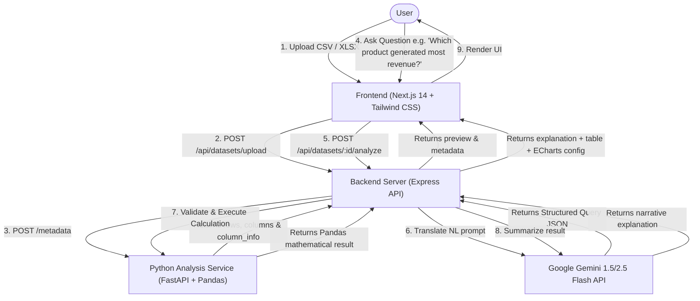

# DataPilot AI 🚀

> **DataPilot AI** is a minimal, production-grade full-stack data analytics web application that translates natural language questions into deterministic Python/Pandas calculations and interactive ECharts visualizations using the **Google Gemini API**.

---

## 🏗️ Architecture & Execution Flow



### Key AI Design Philosophy
> **Zero Guesswork / No Artificial Hallucinations**: Gemini **never** calculates numeric results directly from raw CSV strings. Gemini only acts as an intelligent translator to generate a **validated structured query JSON**. Python Pandas performs the actual mathematical calculation. Gemini then writes a concise narrative explanation based strictly on the calculated output.

---

## ✨ Features

- 📁 **File Upload**: Upload `.csv`, `.xlsx`, or `.xls` spreadsheets (up to 10 MB).
- 🔍 **Interactive Data Preview**: Instant schema detection, column type inference (`number`, `text`, `datetime`), null counts, unique value counts, and paginated 20-row table slicing.
- 💬 **Ask Your Data (Natural Language)**: Query your datasets conversationally with questions like:
  - *"Which product generated the most revenue?"*
  - *"What is the average order value?"*
  - *"Show me the top 10 customers."*
  - *"Which category has the highest sales?"*
- 🛡️ **Safe & Deterministic Calculation Engine**: Enforces a strict allowlist of operations (`sum`, `average`, `count`, `minimum`, `maximum`, `group_and_sum`, `group_and_average`, `top_n`, `bottom_n`, `filter`, `sort`). **No dynamic Python code or SQL execution**.
- 📊 **Dynamic Visualizations**: Automatically converts calculation results into Apache ECharts (Bar charts, Line charts, Pie/Donut charts) and clean result tables.

---

## 🛠️ Technology Stack

- **Frontend**: Next.js 14 (App Router), TypeScript, Tailwind CSS, Lucide Icons, Apache ECharts (`echarts-for-react`).
- **Backend API**: Express.js / Node.js server with Multer file upload handling and Gemini API orchestration.
- **Data Analysis Microservice**: Python 3.14, FastAPI, Pandas, OpenPyXL, Uvicorn, Pytest.
- **AI Engine**: Google Gemini API (`gemini-2.5-flash` / `gemini-1.5-flash` via `@google/genai` / REST).

---

## 📁 Project Structure

```text
drop shipping/
├── analysis-service/           # Python FastAPI Analytics Microservice
│   ├── app/
│   │   ├── __init__.py
│   │   ├── engine.py           # Pandas calculation engine & filter logic
│   │   ├── main.py             # FastAPI REST endpoints (/metadata, /preview, /analyze)
│   │   └── schemas.py          # Pydantic request & response models
│   ├── tests/
│   │   └── test_engine.py      # Pytest suite for calculation engine
│   └── requirements.txt        # Python dependencies
├── backend/                    # Express Backend Orchestration API
│   ├── server.js               # Node API server, Gemini translation & Python client
│   └── package.json            # Backend Node dependencies
├── frontend/                   # Next.js 14 Frontend Application
│   ├── src/
│   │   ├── app/
│   │   │   ├── globals.css
│   │   │   ├── layout.tsx
│   │   │   └── page.tsx        # Main single-page DataPilot AI UI
│   │   ├── components/
│   │   │   ├── DataPreviewTable.tsx
│   │   │   └── EChartWrapper.tsx
│   │   └── lib/
│   │       ├── api.ts          # Axios API client functions
│   │       └── gemini/
│   │           └── GeminiService.ts # Server-side Gemini AI integration
│   └── package.json            # Frontend Node dependencies
├── sample_datasets/
│   └── sales.csv               # Sample sales dataset for quick testing
└── README.md
```

---

## ⚙️ Environment Variables

Create `.env` file in `backend/` or root:

```env
GEMINI_API_KEY=your_google_gemini_api_key_here
GEMINI_MODEL=gemini-2.5-flash
PYTHON_SERVICE_URL=http://127.0.0.1:8000
PORT=3333
```

---

## 🚀 Quick Start Guide

### 1. Start Python Analysis Service

```bash
cd analysis-service
py -3 -m pip install -r requirements.txt
py -3 -m uvicorn app.main:app --host 127.0.0.1 --port 8000 --reload
```
*The FastAPI service will start on `http://127.0.0.1:8000`.*

### 2. Start Backend API Server

```bash
cd backend
npm install
node server.js
```
*The Express backend server will start on `http://127.0.0.1:3333`.*

### 3. Start Frontend Next.js App

```bash
cd frontend
npm install
npm run dev
```
*Open `http://localhost:3000` in your browser.*

---

## 🧪 Running Unit Tests

Run the Python pytest suite:

```bash
$env:PYTHONPATH="analysis-service"; py -3 -m pytest analysis-service/tests/test_engine.py
```

Expected Output:
```text
analysis-service/tests/test_engine.py ..... [100%]
============================== 5 passed in 1.09s ==============================
```

---

## 🛡️ Security & Privacy

- **Server-Side AI Calls**: Gemini API keys are kept strictly on the backend server and never exposed to the client browser.
- **Input & File Validation**: Uploaded files are restricted to `.csv` and `.xlsx` with a strict 10 MB size limit.
- **Safe Execution Allowlist**: Only predefined aggregation and filter functions are allowed. The application rejects arbitrary code execution attempts.

---

## 📜 License

MIT License © DataPilot AI
